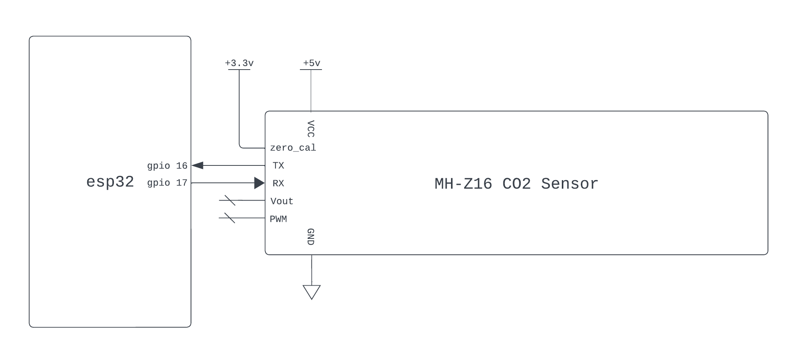

<a name="readme-top"></a>

<summary>Table of Contents</summary>
<ol>
<li>
    <a href="#about">About</a>
</li>
<li>
    <a href="#getting-started">Getting Started</a>
    <ul>
    <li><a href="#wiring">Wiring</a></li>
    <li><a href="#adding-to-project">Adding to Project</a></li>
    <li><a href="#menuconfig">Menuconfig</a></li>
    <li><a href="#examples">Examples</a></li>
    </ul>
</li>
<li><a href="#license">License</a></li>
<li><a href="#contact">Contact</a></li>
</ol>

# About
C++ esp-idf driver component for Winsen Electronic MH-Z16 CO2 sensor.  

The esp-idf driver components for the MH-Z16 currently available on github all use Arduino libraries.  
This is a much lighter weight approach that ditches the Arduino Serial library, ensuring your heap doesn't become swiss cheese.
<p align="right">(<a href="#readme-top">back to top</a>)</p>

# Getting Started 
<p align="right">(<a href="#readme-top">back to top</a>)</p>

## Wiring 
The default wiring is depicted below, it can be changed at driver initialization (see example section).  

If your esp32 does not have the GPIO pin numbers depicted below, you **must change the default GPIO settings in menuconfig**. See the Menuconfig section.  

  

Note the sensor requires a +5v power supply, but uses a 3.3v logic level for UART. In the photo below I am using a boost converter to step up the 3.3v supply from the esp32 to +5v, alternatively, a more suitable power source or battery can be used. The supply must be able to supply 150mA. 


<p align="right">(<a href="#readme-top">back to top</a>)</p>

## Adding to Project
1. Create a "components" directory in the root workspace directory of your esp-idf project if it does not exist already.  

   In workspace directory:     
   ```sh
   mkdir components
   ```


2. Cd into the components directory and clone the esp32_MHZ16 repo.

   ```sh
   cd components
   git clone https://github.com/myles-parfeniuk/esp32_MHZ16
   ```

3. Ensure you clean your esp-idf project before rebuilding.  
   Within esp-idf enabled terminal:
   ```sh
    idf.py fullclean
   ```
<p align="right">(<a href="#readme-top">back to top</a>)</p>

## Menuconfig
This library provides a menuconfig menu configured in Kconfig.projbuild. It contains settings to control the default GPIO and a few other things.  

To access the menu:

1. Within esp-idf enabled terminal, execute the menuconfig command:
    ```sh
    idf.py menuconfig

2. Scroll down to the esp32_MHZ16 menu and enter it, if you're using vsCode you may have to use the "j" and "k" keys instead of the arrow keys.
    

3. Modify whatever settings you'd like from the sub menus. The GPIO Configuration menu allows for the default GPIO pins to be modified, the UART Configuration menu allows for the default host peripheral to be modified.
    
<p align="right">(<a href="#readme-top">back to top</a>)</p>

## Examples
```cpp
// standard library includes
#include <stdio.h>
// esp-idf includes
#include "esp_log.h"
// in-house includes
#include "MHZ16.hpp"

extern "C" void app_main(void)
{
    // create MHZ16 sensor object with default settings
    MHZ16 sensor;

    // disable self calibration (can be enabled if sensor is used in certain environments, see function header)
    sensor.set_self_calibration(false);

    // wait for sensor warmup for accurate measurements (3 minute wait if commented in)
    // sensor.wait_until_warm();

    while (1)
    {
        // requeset a CO2 measurement and print it over serial console
        ESP_LOGI("main", "CO2 PPM: %d", sensor.measure_CO2());
        vTaskDelay(1000 / portTICK_PERIOD_MS);
    }
}
```
<p align="right">(<a href="#readme-top">back to top</a>)</p>

# License

Distributed under the MIT License. See `LICENSE.md` for more information.
<p align="right">(<a href="#readme-top">back to top</a>)</p>

# Contact

Myles Parfeniuk - myles.parfenyuk@gmail.com

Project Link: [https://github.com/myles-parfeniuk/esp32_MHZ16.git](https://github.com/myles-parfeniuk/esp32_MHZ16.git)
<p align="right">(<a href="#readme-top">back to top</a>)</p>